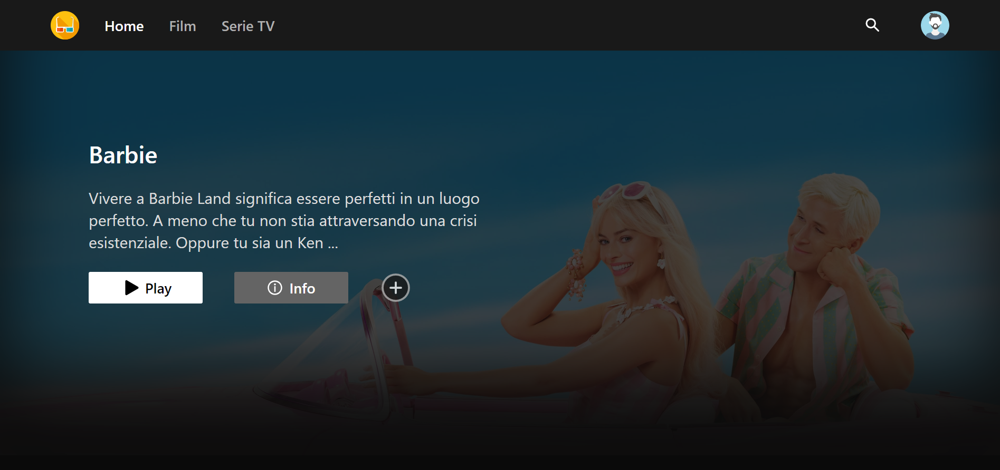
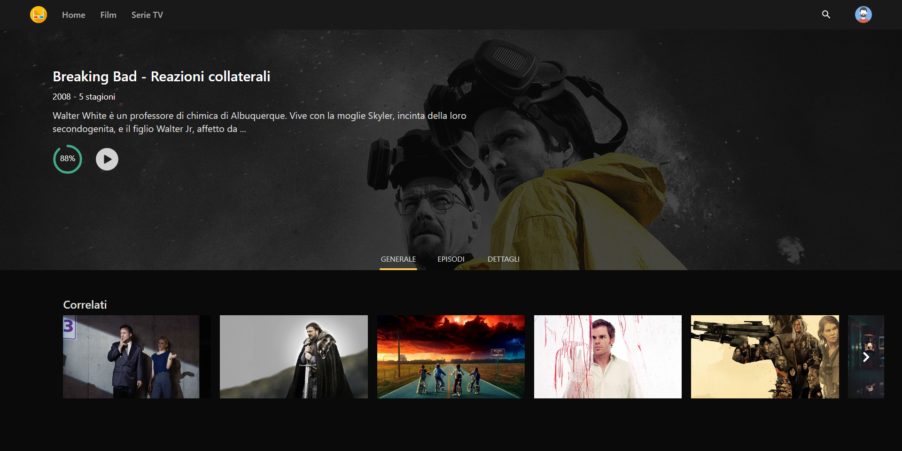
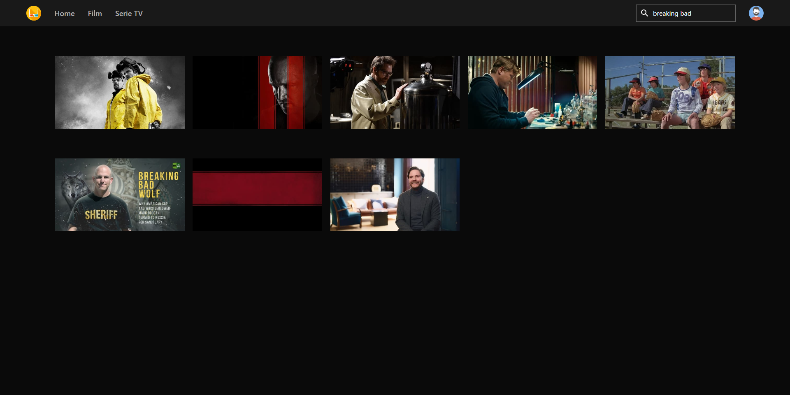
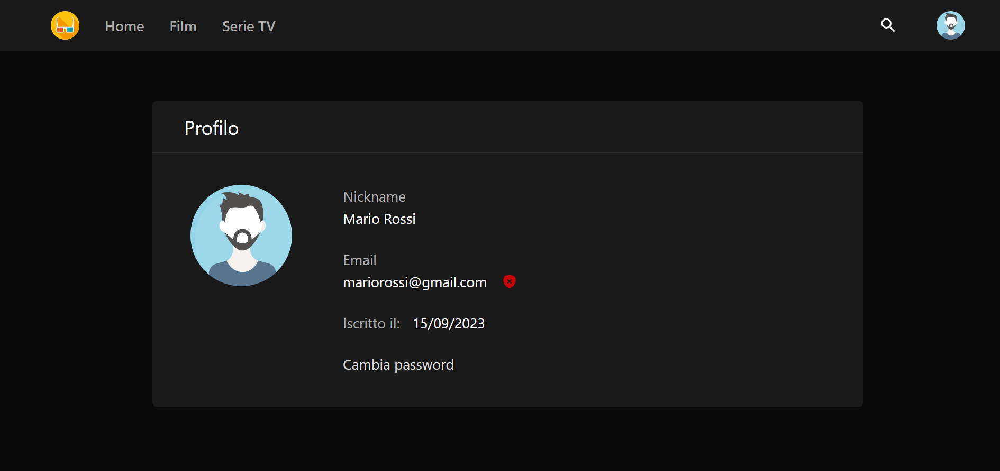
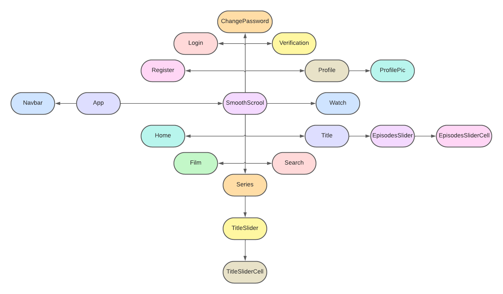
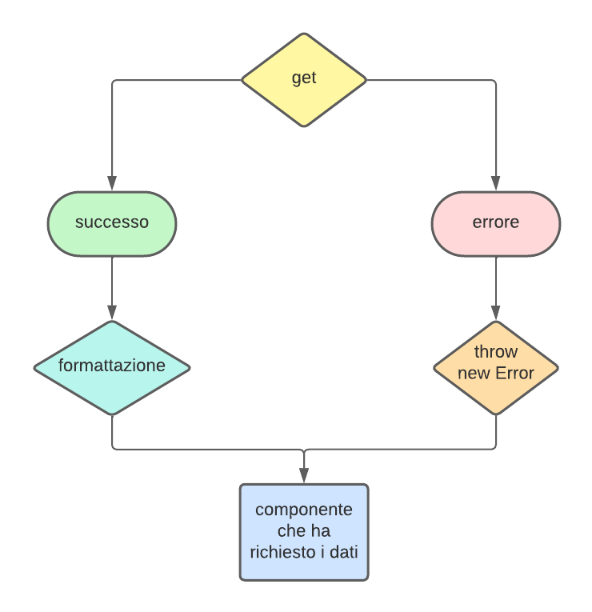

# Streaming App

## Descrizione

L'applicazione consiste in una piattaforma online di streaming di film e serie TV, nella quale è possibile navigare attraverso una vasta gamma di titoli, vederne i dettagli e il contenuto video. Il progetto è stato realizzato con l'ausilio della libreria di sviluppo di applicazioni web *React*.

## Premessa

Dato che la maggior parte dei contenuti multimediali dei titoli sono protetti da copyright, l'app si limita a mostrare altri tipi di video, come ad esempio i trailer dei film e delle serie TV.

## Link

https://streamingapp-8662c.web.app

## Linguaggi

- TypeScript
- JavaScript
- CSS
- HTML

## Librerie

- React
- React Router
- Tailwind CSS

## API

- TMDB API: https://developer.themoviedb.org/docs

## Altri strumenti

- Firebase authentication
- Firestore Database

## Funzioni

- Navigazione tra i titoli più popolati, più votati e quelli in arrivo
- Visione del titolo in evidenza tramite tasto *play*
- Collegamento alla pagina principale del titolo in evidenza tramite tasto *info*
- Filtraggio per film o serie TV

- Panoramica generale del titolo
- Lista degli episodi (solo per le serie TV)
- Dettagli del titolo
- Lista dei correlati

- Ricerca di un titolo specifico, e dei suoi correlati, tramite barra di ricerca

- Creazione di un account
- Personalizzazione della foto di profilo
- Verifica dell'account tramite email
- Cambio della password

- Funzioni base di una PWA:

    1. Installabile
    2. Collegamento alla pagina di fallback in caso di assenza di connessione ad internet

- Invio di notifiche desktop quando:

    1. L'utente ha effettuato la registrazione
    2. L'utente ha cambiato la propria password
    3. Si è verificato un errore durante il login

## Struttura delle cartelle

### pages:

- Contiene i file dei componenti che rappresentano le pagine effettive visualizzabili nella piattaforma

### components:

- Contiene i file delle singole componenti che verranno utilizzate in *App.tsx*, nei file di *pages* e in altri file della cartella stessa *components*

### requests

- Qui vengono gestite tutte le richieste all'API TMDB, formattate nella corretta maniera ed esportate alle componenti che ne richiedono i dati

## Componenti

### App

- Si occupa del rendering di tutti gli altri componenti
- Implementa un sistema di routing per la navigazione tra le varie pagine, grazie alla libreria *React Router*
- Gestisce la creazione e la modifica dello stato globale dell'app

### Navbar

- Componente dedito alla navigazione tra le pagine principali e alla ricerca dei titoli tramite nome
### SmoothScrool

- Implenta un'animazione di scorrimento fino all'inizio della pagina

### Home/Film/Series

- *Home* rappresenta la pagina iniziale con la quale si apre si sito, dove si possono visualizzare i contenuti di ogni tipo
- *Film* e *Series* rappresentano le pagine i cui contenuti sono filtrati rispettivamente per film e serie TV

### TitleSlider/EpisodeSlider

- Sono le componenti che implementano uno slider per la navigazione tramite scorrimento, rispettivamente dei titoli e degli episodi di una serie TV

### TitleSliderCell/EpisodeSliderCell

- Rappresentano le singole celle che costituiscono rispettivamente *TitleSlider* e *EpisodesSlider*

### Search

- Rappresenta la pagina di ricerca dei titoli, che si apre in automatico una volta che l'utente scrive nella barra di ricerca
### Title

- Rappresenta la pagina di un determinato titolo
- Gestisce tutto il sistema di richieste dei dati del titolo in questione

### Watch

- Rappresenta la pagina di visualizzazione del contenuto video

### Profile

- Rappresenta la pagina accedibile tramite navbar, contenente le informazioni dell'account dell'utente

### ProfilePic

- Singola componente che rappresenta una pic per il profilo
- Più *ProfilePic* formano il box di scelta della pic visualizzata nella pagina *profile*

### Login

- Rapprensenta la pagina accedibile tramite navbar, in cui l'utente può effettuare l'accesso

### Register

- Rapprensenta la pagina accedibile tramite navbar, in cui l'utente può effettuare la registrazione

### Verification

- Rappresenta la pagina dove viene rimandato l'utente una volta effettuata la registrazione, o se decide di verificare l'email in un momento successivo tramite l'icona ""

### ChangePassword

- Rappresenta la pagina dove viene rimandato l'utente in caso decida di cambiare la propria password

## Relazioni di importazioni dei componenti

## Custom Hooks

- useTimeout(callback, delay): esegue *callback* dopo il lasso di tempo definito da *delay*
     
    Riferimenti:
    - GitHub: https://github.com/WebDevSimplified/useful-custom-react-hooks.git
    - Video: https://www.youtube.com/watch?v=0c6znExIqRw&t=232s&ab_channel=WebDevSimplified

## Gestione delle richieste all'API TMDB

