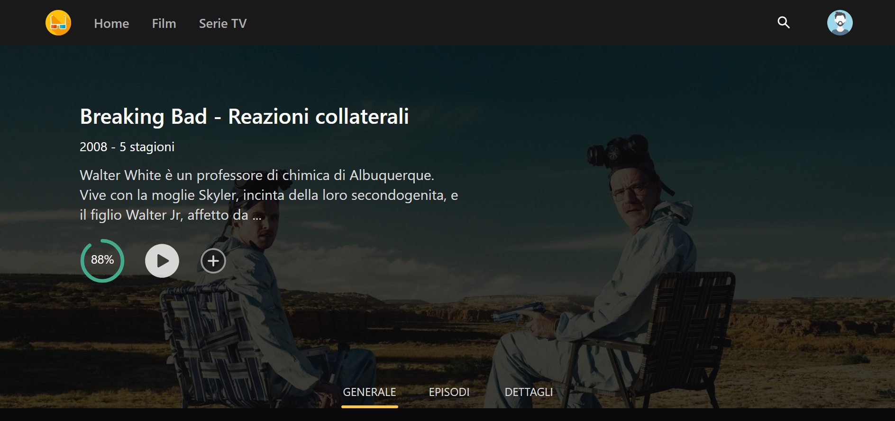

# Streaming App

## Descrizione

L'applicazione consiste in una piattaforma online di streaming di film e serie TV, nella quale è possibile navigare attraverso una vasta gamma di titoli, vederne i dettagli e prendere visione del contenuto video effettivo.

 

## Premessa

Dato che la maggior parte dei contenuti multimediali dei titoli sono protetti da copyright, l'app si limita a mostrare altri tipi di video, come ad esempio i trailer dei film e delle serie TV.

 

## Linguaggi

- TypeScript
- JavaScript
- CSS
- HTML

 

## Librerie

- React
- React Router
- Tailwind CSS

 

## API

- TMDB API: https://developer.themoviedb.org/docs

 

## Altri strumenti

- Firebase authentication
- Firestore Database

 

## Funzioni

- Navigazione tra i titoli più popolati, più votati e quelli in arrivo
- Visione del titolo in evidenza tramite tasto *play*
- Collegamento alla pagina principale del titolo in evidenza tramite tasto *info*
- Filtraggio per film o serie TV

 

 

- Panoramica generale del titolo
- Lista degli episodi (solo per le serie TV)
- Dettagli del titolo
- Lista dei correlati

 

 

- Ricerca di un titolo specifico, e dei suoi correlati, tramite barra di ricerca

 

 

- Creazione di un account
- Personalizzazione della foto di profilo
- Verifica dell'account tramite email
- Cambio della password

 

 

- Funzioni base di una PWA:

    1. Installabile
    2. Collegamento alla pagina di fallback in caso di assenza di connessione ad internet

 

- Invio di notifiche desktop quando:

    1. L'utente ha effettuato la registrazione
    2. L'utente ha cambiato la propria password
    3. Si è verificato un errore durante il login

 

## Struttura del progetto

### App.tsx:

- Si occupa del rendering delle varie pagine e dei componenti attraverso il sistema di routing offerto dalla libreria *React Router*
- Gestisce la creazione e la modifica dello stato globale dell'app

 

### pages:

- Contiene i file dei componenti che rappresentano le pagine effettive visualizzabili nella piattaforma

 

### components:

- Contiene i file delle singole componenti che verranno utilizzate in *App.tsx*, nei file di *pages* e in altre componenti della cartella stessa *components*

 

### requests

- Qui vengono gestite tutte le richieste all'API TMDB, formattate nella corretta maniera ed esportate alle componenti che ne richiederanno i dati

 

### index.html

- E' la pagina principale dove verranno renderizzati gli elementi tramite la libreria *React*

 

### offline.html

- E' la pagina di fallback che verrà automaticamente visualizzata in mancanza di connessione ad internet

 

